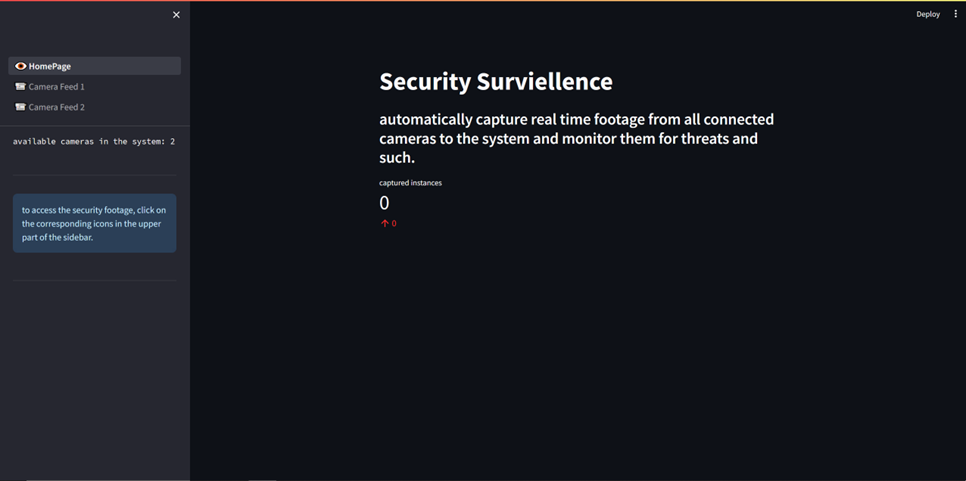
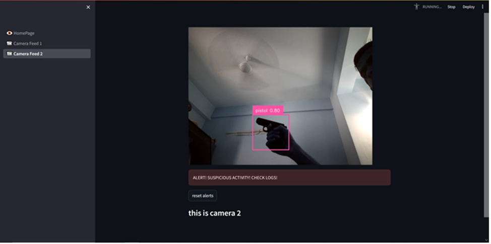

# Weapon Detection System using YoloV8 for video

This model is `yolov8sbest.pt` and it is trained using `roboflow`(custom dataset) and `colab` and used here for inference.

the `streamlit` application is launched on the local server and shows available cameras for surviellance, We can use multiple cameras at the same time to look at different perspectives.

this has the feature to capture and store images in local device when a Weapon is detected and alerts can be resolved by using reset alerts button.

Process to run the code:
On virtual environment/or any preferable environment with the given neccessary dependencies run the webapp by typing in terminal `streamlit run app.py` in the main directory.

Each camera calls the `process` method from the `base` file and will save images with confidence>0.6 and 5 continuous frames in user directory.

